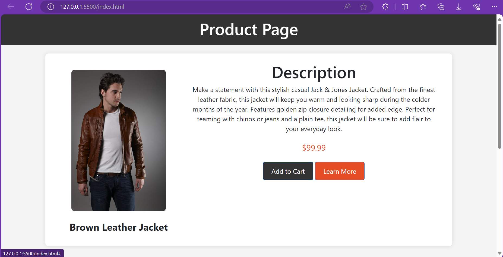

# Product-Page

This project showcases a stylish and responsive product page with a focus on a featured product and recommended items. The page is designed using HTML for structure and Bootstrap 4.3.1 for styling, providing an attractive and user-friendly experience.

## Preview

[](index.html)

## Features

- **Featured Product:** Highlighted with an image, name, description, and price.
- **Recommended Products:** Additional items displayed with images, prices, and descriptions.
- **Responsive Design:** Ensures optimal viewing on various devices, from desktops to mobiles.

## Technologies Used

- **HTML:** Markup language for structuring the web page.
- **Bootstrap 4.3.1:** Front-end framework for styling and layout.

## How to Use

1. **Clone the repository:**
    ```bash
    git clone https://github.com/AnjaliPujala/Product-Page.git
    ```

2. **Open the Product Page:**
    - Open the `index.html` file in a web browser to view the product page.
    - Explore the featured product and recommended items.

3. **Customize the Project:**
    - Modify the content in the HTML file to feature different products.
    - Customize the styling by updating the `style.css` file.

## Custom Styles

The project includes a custom CSS file (`style.css`) for additional styling, providing a clean and modern design.

## Structure

- **Header Section:** Displays the product page title.
- **Featured Product Section:** Showcasing a specific product with image, name, description, and price.
- **Recommended Products Section:** Featuring additional items with images, prices, and descriptions.

## Contributing

Contributions are welcome! If you have any suggestions, improvements, or bug fixes, feel free to open an issue or create a pull request.


## Author

- **Anjali Pujala**
  - GitHub: [AnjaliPujala](https://github.com/AnjaliPujala)
